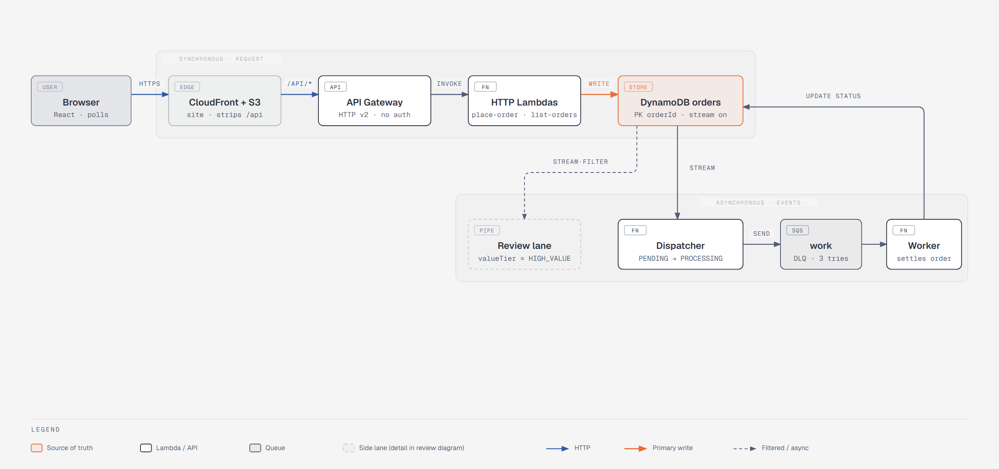
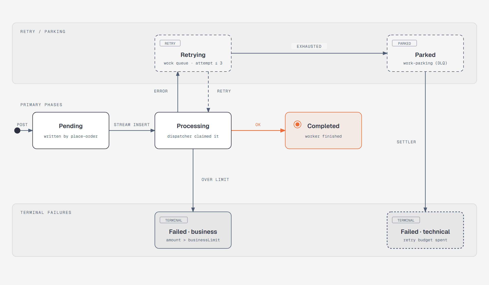
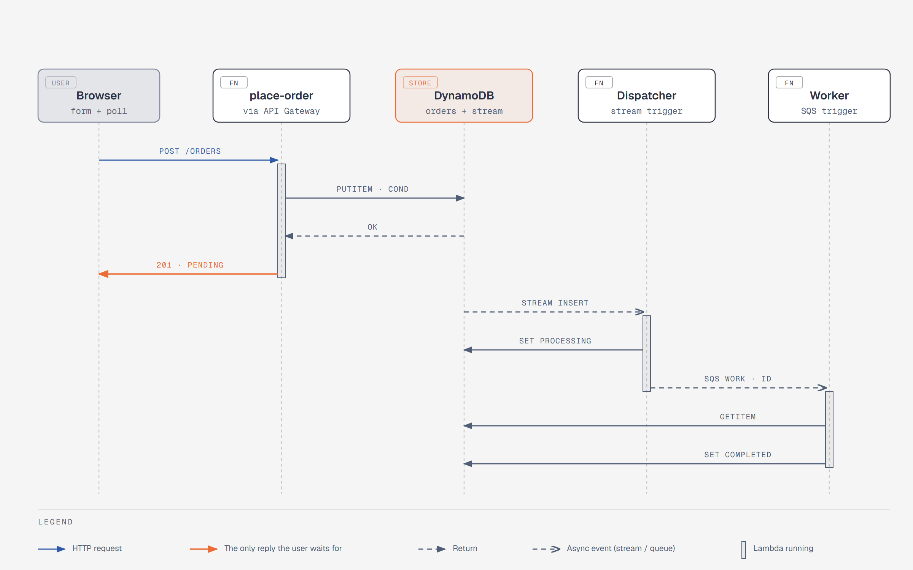
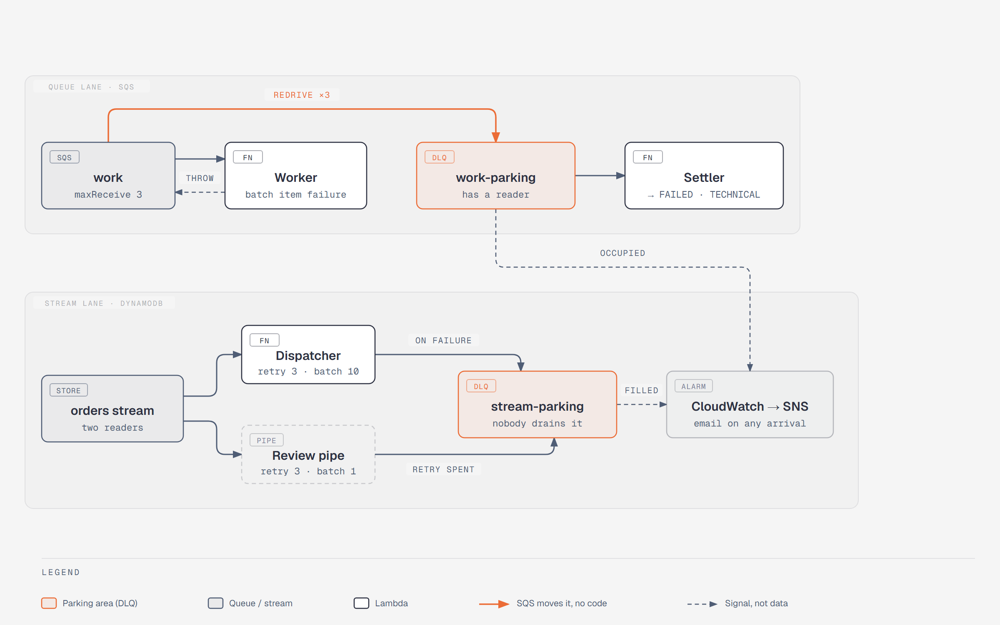
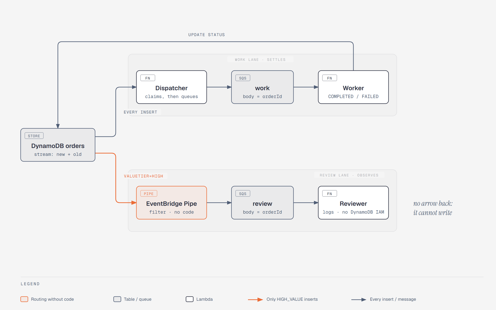

# Order Pipeline — System Design

Tài liệu này ghi lại **hệ thống được thiết kế như thế nào và vì sao**, cùng cách nó được xây,
test, debug và quan sát. Dành cho người tiếp nhận project hoặc quay lại sau một thời gian.
Để tra API thì đọc code; để chạy local thì xem [README](../README.md).

Cách đọc nhanh: mục 3 (bức tranh), mục 4 (vòng đời đơn), mục 8 (các quyết định), mục 9 đến 12
(cách làm). Các sơ đồ có bản HTML gốc trong [diagrams/](diagrams/), mở bằng trình duyệt để xem
nét hơn.

---

## 1. Bài toán

Một sàn e-commerce nhận hàng trăm đơn mỗi ngày. Mỗi đơn kéo theo nhiều việc: ghi nhận, kiểm
tra nghiệp vụ, xử lý nền, xử lý lỗi và retry, báo cho bộ phận vận hành khi có sự cố. Hệ cũ là
**một server làm tất cả trong một request**.

| Nỗi đau của hệ cũ | Yêu cầu cho hệ mới | Giải bằng |
|---|---|---|
| Chậm khi peak | Nhận đơn tức thì, xử lý sau | API trả `201` ngay, phần còn lại chạy theo sự kiện |
| Đơn lỗi khó truy | Mọi trạng thái nằm một chỗ, xem được | Một bảng DynamoDB là nguồn sự thật, có `GET /orders` |
| Một lỗi chặn cả request | Từng bước độc lập, lỗi được cô lập | Stream, queue, mỗi bước một Lambda |
| Không retry | Retry tự động, hết retry thì "đỗ" vào chỗ riêng | SQS redrive + DLQ + Settler |
| Đơn giá trị cao không được đối xử riêng | Định tuyến theo nội dung đơn | EventBridge Pipe lọc `valueTier` |
| Không ai biết khi hỏng | Alarm gửi email | 7 alarm CloudWatch → SNS |

---

## 2. Ràng buộc và những thứ cố ý không làm

Ràng buộc tự đặt:

- **Serverless hoàn toàn.** Không VPC, không server, không container chạy thường trực.
- **Hạ tầng là code.** CDK C# là nguồn sự thật duy nhất; không click Console.
- **Chạy được local mà không chạm AWS thật.** Aspire AppHost, và hàng rào an toàn nằm trong
  code chứ không nằm ở biến môi trường người chạy phải nhớ đặt.
- **Chi phí gần bằng không khi không dùng.** Pay-per-request, không reserved concurrency,
  telemetry tắt trên AWS.

Cố ý không làm (non-goals), ghi rõ để tránh bị bổ sung ngoài ý định:

- **Không auth.** API mở, chỉ phục vụ dữ liệu demo. Thêm identity provider chỉ che mất thứ
  hệ này tồn tại để cho thấy: xử lý bất đồng bộ.
- **Không WAF, không throttling.** Giới hạn độ dài input là hàng rào duy nhất.
- **Không multi-region, không PITR.** Bảng bị vứt đi cùng stack.
- **Reviewer không duyệt đơn.** Nó chỉ log; chỗ cắm fraud check hay duyệt tay là việc sau.

---

## 3. Bức tranh tổng thể

Đọc sơ đồ từ trái sang phải: nửa trên là **đường đồng bộ**, kết thúc khi API trả lời. Nửa
dưới là **đường bất đồng bộ**, bắt đầu từ stream của bảng và không bao giờ chờ người dùng.
Bảng `orders` là node duy nhất được tô màu vì nó là nguồn sự thật: mọi Lambda khác chỉ đọc
hoặc đổi trạng thái trên đó.

| Thành phần | Vai trò một dòng | Chạy khi |
|---|---|---|
| CloudFront + S3 | Phục vụ web tĩnh, chuyển tiếp `/api/*` sang API Gateway cùng origin | Mỗi request từ trình duyệt |
| API Gateway (HTTP v2) | Cửa vào, không auth, CORS mở | Mỗi request |
| `get-health`, `place-order`, `list-orders` | Ba Lambda phía HTTP, xong việc là trả lời ngay | Mỗi request |
| `orders` (DynamoDB) + stream | Nguồn sự thật; mỗi lần ghi phát một sự kiện | Luôn |
| `dispatch-placed-orders` (Dispatcher) | Đọc stream, chuyển PENDING → PROCESSING, giao việc vào queue | Mỗi INSERT |
| `work` (SQS) + `complete-orders` (Worker) | Nơi nghiệp vụ thật chạy, có retry | Mỗi message |
| `work-parking` (DLQ) + `settle-failures` (Settler) | Bãi đỗ cho việc hỏng, và người ghi FAILED cho đơn bị đỗ | Khi hết retry |
| Pipe `review-routing` + `review` + `review-orders` (Reviewer) | Làn riêng cho đơn giá trị cao, chỉ quan sát | Mỗi INSERT có `valueTier = HIGH_VALUE` |
| `stream-parking` | Bãi đỗ cho record stream mà cả hai người đọc stream đều bỏ cuộc | Hiếm, và khi có là sự cố |
| 7 alarm + SNS | Cảnh báo khi bất kỳ làn nào ứ, hỏng hay chậm | 1 phút một lần đánh giá |

---

## 4. Vòng đời một đơn hàng

Ba quy tắc bất biến:

1. **Chỉ có ba chuyển trạng thái hợp lệ**: PENDING→PROCESSING, PROCESSING→COMPLETED,
   PROCESSING→FAILED. Domain (`OrderLifecycle.CanTransition`) từ chối mọi chuyển khác
   trước khi chạm DynamoDB.
2. **COMPLETED và FAILED là terminal.** Không có đường quay lại. Frontend dừng polling khi
   mọi đơn đã terminal.
3. **Mỗi chuyển trạng thái là một conditional update** trên trạng thái trước đó. Nếu điều
   kiện sai vì ai đó đã chuyển rồi, kết quả là `AlreadyMovedOn` và **được coi là thành
   công**. Đây là toàn bộ cơ chế idempotency của hệ.

Hai ngưỡng tiền, đọc từ `cdk.json`, cùng một file cho local lẫn deploy:

| Ngưỡng | Giá trị dev | Tác dụng | Ai áp dụng |
|---|---|---|---|
| `highValueThreshold` | 10 000 | `amount >` ngưỡng → `valueTier = HIGH_VALUE`, đi thêm làn review | `place-order`, tính một lần |
| `businessLimit` | 50 000 | `amount >` ngưỡng → Worker từ chối, FAILED (BUSINESS) | Worker |

Constructor `OrderThresholds` ép `businessLimit > highValueThreshold`. Nếu không, mọi đơn giá
trị cao đều bị từ chối và làn review không bao giờ có việc thật.

Bốn kịch bản chuẩn, dùng cho cả nghiệm thu sau deploy lẫn giải thích hệ thống:

| Đơn | Kết quả | Đi qua đâu |
|---|---|---|
| 1 499, notes rỗng | COMPLETED | work → Worker |
| 12 000, notes rỗng | COMPLETED **và** một dòng log "needs review" | work → Worker; stream → Pipe → review → Reviewer |
| 60 000 | FAILED (BUSINESS), không retry | work → Worker ghi FAILED ngay lần đầu |
| 1 500, notes `FAIL_ON_PURPOSE` | FAILED (TECHNICAL) sau 3 lần retry | work ×3 → work-parking → Settler; alarm `parking-area-occupied` kêu |

### 4.1 Mô hình dữ liệu

Một bảng, khoá chính đơn `orderId`, không sort key. Mỗi item:

| Attribute | Kiểu | Ghi bởi | Ghi chú |
|---|---|---|---|
| `orderId` | S | place-order | GUID |
| `customerName`, `product`, `notes` | S | place-order | Đã trim; giới hạn 200 / 200 / 1000 ký tự |
| `amount` | N | place-order | Invariant culture |
| `status` | S | mọi Lambda ghi | `PENDING`, `PROCESSING`, `COMPLETED`, `FAILED` |
| `valueTier` | S | place-order | `HIGH_VALUE` hoặc `STANDARD`; Pipe lọc trên cột này |
| `placedAt` | S | place-order | ISO-8601 round-trip, có offset |
| `recencyBucket` | S | place-order | Luôn `ALL`; partition key của GSI |
| `recencyCursor` | S | place-order | `utc-timestamp#orderId`; sort key của GSI |
| `failureKind`, `failureReason` | S | Worker, Settler | `BUSINESS` / `TECHNICAL` kèm câu giải thích |

GSI `by-recency` (`recencyBucket`, `recencyCursor`, projection ALL) cho phép **một Query giảm
dần** trả về đơn mới nhất. Phân trang bằng cursor mờ: Base64 của ba thuộc tính khoá. Client
không được hiểu nó, server từ chối mọi cursor không do mình phát ra, và trường `nextCursor`
**vắng mặt** nghĩa là hết trang.

Quyền truy cập, viết tay từng action, là bằng chứng cho vai trò của từng Lambda:

| Lambda | DynamoDB | SQS |
|---|---|---|
| place-order | `PutItem` trên bảng | — |
| list-orders | `Query` trên index `by-recency` **duy nhất** | — |
| Dispatcher | `UpdateItem` + đọc stream | `SendMessage` work |
| Worker | `GetItem`, `UpdateItem` | nhận từ work |
| Settler | `UpdateItem` | nhận từ work-parking |
| Reviewer | **không có** | nhận từ review |

Không ai có `Scan`. Test CDK khẳng định bảng này.

---

## 5. Đường đi của một request

Mũi tên màu cam là **lần trả lời duy nhất người dùng phải chờ**. Mọi thứ sau đó là sự kiện.

1. Trình duyệt `POST /api/orders` cùng origin. CloudFront (hoặc Vite proxy khi chạy local) bỏ
   tiền tố `/api` rồi chuyển sang API Gateway.
2. `place-order` parse và validate body. Tính `valueTier`. `PutItem` với điều kiện
   `attribute_not_exists(orderId)`. Trả `201`, header `Location` và `x-correlation-id`.
3. Stream phát record INSERT. **Dispatcher** đổi PENDING → PROCESSING có điều kiện, rồi gửi
   `orderId` vào `work` kèm message attribute `traceparent`. Thắng hay thua điều kiện đều gửi,
   vì lần chạy trước có thể đã chết giữa hai bước.
4. **Worker** nhận `orderId`, đọc đơn bằng consistent read (vừa được ghi vài mili giây trước),
   áp ba nhánh ở mục 4, ghi trạng thái cuối có điều kiện.
5. Trình duyệt poll `GET /orders` và thấy trạng thái đổi. Nhịp poll: 2 s khi còn đơn chưa
   terminal, 10 s sau 60 s liên tục, và khi mọi đơn đã settled thì chạy nốt 5, 5, 15, 15 giây
   rồi **dừng hẳn**. Không poll khi tab ẩn hay offline.

Correlation id đổi chủ tại ranh giới stream: nhánh đồng bộ dùng request id của API Gateway,
mọi nhánh bất đồng bộ dùng `orderId`, vì không có gì mang request id đi qua stream. Hai nhánh
gặp nhau tại dòng log "Order X accepted".

---

## 6. Khi mọi thứ hỏng

Bài học trung tâm của toàn hệ là **hai loại lỗi đi hai đường khác nhau**:

| | Lỗi nghiệp vụ | Lỗi kỹ thuật |
|---|---|---|
| Ví dụ | Vượt `businessLimit` | Timeout, DynamoDB lỗi, `FAIL_ON_PURPOSE` |
| Worker làm gì | Ghi FAILED (BUSINESS) rồi **coi message là xong** | Trả batch-item failure, **không đổi trạng thái** |
| Retry? | Không, retry không đổi được kết quả | Có, SQS giao lại tới 3 lần |
| Kết cục | Đơn FAILED ngay lần đầu | Sau 3 lần, SQS chuyển message sang `work-parking` |
| Ai ghi lý do | Worker | Settler |

Nhầm hai loại này thì hoặc retry vô ích và làm DLQ đầy rác, hoặc mất đơn.

**Làn queue** (nửa trên): cơ chế redrive là của SQS, không phải code. Sau `maxReceiveCount = 3`
message tự sang `work-parking`. Settler đọc bãi đỗ và ghi FAILED (TECHNICAL) kèm lý do "spent
its whole retry budget". Settler **không đọc** đơn, chỉ ghi có điều kiện; nếu đơn đã COMPLETED
thì `AlreadyMovedOn` và bỏ qua. Alarm `parking-area-occupied` kêu ngay khi bãi đỗ có message.

**Làn stream** (nửa dưới): cả Dispatcher lẫn Pipe đều có thể bỏ cuộc sau 3 lần với một record.
Mặc định AWS là "thử mãi cho tới khi record hết hạn sau 24 giờ", nghĩa là mất im lặng. Cả hai
trỏ `OnFailure` về `stream-parking`, một queue **không ai tiêu thụ**. Alarm theo
`NumberOfMessagesSent` (số message **đến**), không theo độ sâu, vì "có message tới" là toàn
bộ tín hiệu.

Ba con số bảo vệ nhau:

| Hằng số | Giá trị | Vì sao |
|---|---|---|
| Lambda timeout | 30 s | Đủ cho một batch 10 |
| Visibility timeout của work queue | 180 s = 6 × timeout | Message chỉ được giao lại khi chắc chắn lần xử lý trước đã dừng |
| Retry budget (SQS, stream, pipe) | 3, ba hằng riêng | Ba cơ chế retry độc lập; gộp lại sẽ khiến người sau tưởng chúng buộc phải bằng nhau |

---

## 7. Làn review: một stream, hai người đọc

Pipe đọc **stream**, không đọc `work`. Đây là quyết định quan trọng nhất của làn này. SQS giao
mỗi message cho **đúng một** consumer; nếu Pipe và Worker cùng đọc `work`, một đơn giá trị
cao hoặc được xử lý hoặc được review, không bao giờ cả hai. Stream thì ai đọc cũng thấy toàn
bộ.

Pipe không có code: filter là một event pattern
`{"eventName":["INSERT"],"dynamodb":{"NewImage":{"valueTier":{"S":["HIGH_VALUE"]}}}}`, target
là queue `review`, input template chỉ lấy `orderId`. Batch 1, retry 3, DLQ là `stream-parking`.
Pipe mặc định không ghi log, nên có log group riêng ở mức ERROR kèm execution data, và alarm
`review-routing-broken` theo dõi `ExecutionFailed + TargetStageFailed + ExecutionThrottled`.

Reviewer chỉ log "Order X is high value and needs review" và nối vào trace của Dispatcher qua
`traceparent`. Nó **không có quyền DynamoDB nào**. "Không có cách nào để ghi" là lời hứa mạnh
hơn "chọn không ghi". Trong hệ thật, đây là chỗ cắm fraud check, duyệt tay, hoặc báo bộ phận
tài chính.

---

## 8. Các quyết định thiết kế và lý do

Mỗi mục: **quyết định → vì sao → điều gì hỏng nếu làm cách hiển nhiên hơn**. "Thiết kế tham
chiếu" là bản làm tay trên Console mà project này xuất phát; nhắc để thấy điểm khác.

### Dữ liệu và sự kiện

**8.1 Pipe đọc từ DynamoDB Stream, không đọc từ SQS `work`.** Thiết kế tham chiếu cho Pipe và
Worker cùng đọc một queue, tức hai consumer cạnh tranh. Xem mục 7.

**8.2 Tách `highValueThreshold` khỏi `businessLimit`.** Thiết kế tham chiếu dùng cùng một số
cho cả "cần review" và "bị từ chối", nên đơn giá trị cao vừa FAILED vừa được route đi review.
Hai ngưỡng tách biệt tạo ra vùng "cao nhưng hợp lệ" là vùng review có ý nghĩa.

**8.3 `valueTier` lưu dạng chuỗi, tính một lần lúc đặt đơn.** Pipe lọc trên `NewImage`; lọc
chuỗi là pattern đơn giản và ổn định nhất. Lọc số trên `amount` sẽ nhân đôi logic ngưỡng vào
CDK. Mọi nơi khác chỉ đọc kết quả, không tính lại.

**8.4 Conditional update cho mọi chuyển trạng thái; thua race là thành công.** Stream, SQS và
Pipe đều at-least-once. Không có điều kiện, một lần redelivery có thể ghi PROCESSING đè lên
COMPLETED. Với điều kiện `status = :from`, lần thứ hai thua và trả `AlreadyMovedOn`.

**8.5 GSI `by-recency` với một bucket `ALL`.** Bảng chỉ có PK `orderId` nên "đơn mới nhất" cần
index. Bucket cố định + sort key `utc#orderId` cho phép một Query giảm dần. Đây là hot
partition có chủ đích, đủ tới vài trăm ghi/giây, ghi rõ trong code để người sau biết khi nào
phải chia bucket. `recencyCursor` tách khỏi `placedAt` vì `placedAt` mang offset nên thứ tự
chữ không bằng thứ tự thời gian.

**8.6 Cursor phân trang là chuỗi mờ.** Client không cần biết cấu trúc khoá; đổi index sau này
không phá client.

### Độ tin cậy

**8.7 `ReportBatchItemFailures` ở mọi event source.** Thiết kế tham chiếu ném lỗi cho cả
batch, kéo message lành đi retry cùng message hỏng. Trả danh sách id hỏng thì chỉ retry đúng
phần hỏng.

**8.8 Lỗi nghiệp vụ và lỗi kỹ thuật đi hai đường.** Xem mục 6.

**8.9 Settler: DLQ không phải điểm cuối.** Thiết kế tham chiếu dừng ở "message nằm trong DLQ",
nên đơn kẹt PROCESSING mãi và bảng dữ liệu nói dối.

**8.10 `stream-parking` cho cả hai người đọc stream, alarm theo số message đến.** Xem mục 6.

**8.11 Ba hằng retry bằng nhau nhưng tách riêng; visibility = 6 × timeout.** Xem bảng cuối
mục 6.

**8.12 Dispatcher luôn enqueue, kể cả khi thua race.** Lần chạy trước có thể chết giữa "đổi
trạng thái" và "gửi queue". Gửi thừa vô hại vì Worker idempotent; gửi thiếu thì đơn kẹt.

### Bảo mật và vận hành

**8.13 IAM viết tay từng action, mỗi Lambda một role.** `Table.Grant*` của CDK mở rộng quyền ra
cả index. Viết tay cho phép test khẳng định bảng ở mục 4.1. Emulator local không kiểm IAM, nên
đây là thứ chỉ nghiệm thu được sau deploy.

**8.14 cdk-nag ở cấp App, mọi suppression có lý do bằng văn.** Thước đo thật là
`npx cdk synth -c stage=dev`; test `NagComplianceTests` bỏ sót cảnh báo, đã đo. Suppression
đáng nhớ: API mở (APIG4), `review` và các parking không có DLQ (SQS3, vì chúng **là** bãi đỗ
hoặc không settle đơn), không PITR (bảng vứt đi cùng stack).

**8.15 Alarm coi thiếu dữ liệu là bình thường.** Queue rỗng không báo metric; `TreatMissingData
= NOT_BREACHING` để alarm không kêu oan lúc nửa đêm.

**8.16 Telemetry chỉ bật khi có endpoint.** OpenTelemetry export khi `OTEL_EXPORTER_OTLP_ENDPOINT`
có giá trị. AppHost inject, CDK không. Trên AWS exporter tắt, không tốn gì. Log JSON ra stdout
luôn có vì CloudWatch đọc từ đó.

### Frontend và local

**8.17 Frontend cùng origin với API qua CloudFront.** Behaviour `/api/*` trỏ sang API Gateway,
kèm CloudFront Function bỏ tiền tố `/api`. Vite dev proxy làm y hệt. Kết quả: bundle không
chứa URL theo account, không cross-origin, một `.env` duy nhất cho cả local lẫn deploy. Chỉ
map 403 → `index.html` (OAC trả 403 cho key thiếu); map cả 404 sẽ nuốt mất 404 thật của API.

**8.18 Polling tự dừng.** View này tồn tại để **nhìn đơn di chuyển**, không phải để giữ kết
nối mãi. Xem nhịp ở mục 5.

**8.19 Local bằng Aspire, không LocalStack.** AppHost chạy DynamoDB Local (chính chủ AWS),
Lambda Test Tool, API Gateway emulator và Vite. LocalStack từng được thử và là nguồn của mọi
phiền toái (bootstrap giả, poller nối tay, quirk region, credential giả). Đổi lại, SQS không có
emulator chính chủ, nên bốn Lambda phía queue chỉ chạy thật sau deploy. AppHost **ném lỗi nếu
ở publish mode**.

**8.20 Một assembly, bảy Lambda, chọn bằng env `ORDER_PIPELINE_HANDLER`.** Một asset CDK duy
nhất, build và upload một lần; test khẳng định cả bảy dùng chung một S3 key. .NET 10 chạy
custom-runtime bootstrap, nên telemetry phải tự dựng vì Lambda Annotations không khởi động
hosted service.

---

## 9. Cách hệ thống được thiết kế và xây

### 9.1 Quy trình

Mỗi tính năng đi qua cùng một chuỗi: **làm rõ bài toán → PRD → plan theo phase → làm →
review**. Plan chia thành các phase là **lát cắt dọc** (tracer bullet): mỗi phase đi xuyên đủ
các lớp từ CDK, Lambda, đến UI và test, thay vì hoàn thành một lớp rồi mới sang lớp khác.
Tính năng chính có 11 phase; sau đó là các plan song song cho hardening, sửa sau review, và
đưa local dev về đúng mô hình Aspire.

Thứ tự thiết kế đi từ ngoài vào trong:

1. **Bắt đầu từ nỗi đau**, không từ service. Sáu nỗi đau ở mục 1 quyết định sáu năng lực,
   rồi mới chọn service AWS cho từng năng lực.
2. **Lấy thiết kế tham chiếu làm baseline** rồi tìm chỗ nó hổng khi chạy thật (hai consumer
   một queue, ngưỡng trùng, DLQ không có người đọc). Mỗi chỗ hổng thành một quyết định ở mục 8.
3. **Domain trước, hạ tầng sau.** Project Domain không phụ thuộc gì, mô tả trạng thái, chuyển
   trạng thái, ngưỡng và rule bằng kiểu C# thuần. Adapter và CDK tuân theo Domain, không
   ngược lại.
4. **Mỗi quyết định phải có một chỗ neo trong code**: hoặc là comment giải thích "vì sao" ngay
   tại chỗ, hoặc là một test khoá quyết định lại (xem mục 10.3). Không có tài liệu nào là nguồn
   sự thật thay cho code.

### 9.2 Một nguồn sự thật cho cấu hình

Cùng một giá trị không được khai báo hai lần ở hai nơi có thể lệch nhau:

| Thứ dùng chung | Nơi khai báo | Nơi dùng lại |
|---|---|---|
| Tên env, tên attribute, tên index, route, header, tên handler | project `Contracts` | CDK, AppHost, Lambda, test |
| Ngưỡng tiền, region, tag, email alarm | `cdk.json` `context.stages.<name>` | CDK qua `StageConfig.FromContext`, AppHost qua `StageConfig.FromCdkJson` |
| Schema bảng `orders` | `DataConstruct` (CDK) | AppHost chép lại trong `LocalOrdersTable`, có ghi chú "đổi một thì đổi cả hai" |

Ngoại lệ duy nhất là schema bảng: AppHost không dùng được construct CDK để tạo bảng trên
DynamoDB Local, nên phải chép. Đây là chỗ lệch tiềm ẩn cần kiểm tra khi đổi schema.

### 9.3 Build và đóng gói

- **Build .NET không cho phép warning** (`TreatWarningsAsErrors` trong `Directory.Build.props`).
  `nuget.config` chỉ cho phép nuget.org.
- **Lambda được publish trong Docker** bằng image bundling chính chủ của CDK cho .NET 10, một
  lần cho cả bảy function. Loại trừ `bin`, `obj`, `tests`, AppHost, Infrastructure và frontend
  khỏi asset để hash không đổi khi chỉ sửa test.
- **Frontend được build trong Docker** (`node:22-alpine`, `npm ci && npm run build`) rồi
  `BucketDeployment` đẩy lên S3 và invalidate CloudFront. Máy deploy không cần Node đúng
  phiên bản.
- **AppHost chỉ là run-mode.** Nó ném lỗi nếu bị publish, nên không có nguy cơ hai đường
  deploy khác nhau.
- File `serverless.template` do Lambda Annotations sinh ra bị `.gitignore`, vì deploy là
  CDK chứ không phải SAM.

---

## 10. Cách hệ thống được test

### 10.1 Tháp test

| Tầng | Công cụ | Mock ở đâu | Đếm |
|---|---|---|---|
| Domain | xUnit | không mock, thuần | 75 |
| Handlers + adapters | xUnit + NSubstitute | `IAmazonDynamoDB`, `IAmazonSQS`, `ILambdaContext` | 148 |
| CDK template + cdk-nag | xUnit + `Template.FromStack` | không | 73 |
| Qua AppHost thật | xUnit + `Aspire.Hosting.Testing` | không | 1, opt-in |
| Frontend unit | Vitest + Testing Library | một seam duy nhất `createOrderGateway` | 75 |
| E2E | Playwright | **không mock**, AppHost thật | 7 |

### 10.2 Nguyên tắc

- **Unit test mock ở đúng một seam.** Phía .NET là client AWS SDK; phía frontend là hàm tạo
  gateway. Không mock sâu hơn, không mock nông hơn, để test không lệch với hành vi thật.
- **E2E là thật.** Không `page.route`, không stub API. Playwright tự khởi động AppHost qua
  `e2e/host.ts` với profile `e2e`, chờ cổng 5173 trả lời, và tự dọn container mồ côi khi
  xong. Không dùng `webServer` của Playwright vì trên Windows nó SIGKILL cả process group
  trước khi Aspire kịp dọn container.
- **Test hạ tầng chạy trên template đã synth**, không cần AWS: khẳng định IAM, event source,
  alarm, pipe filter, CloudFront behaviour. Bundling Docker bị tắt trong test để synth nhanh.
- **Test Aspire opt-in** bằng biến `ORDER_PIPELINE_ASPIRE_TESTS=1` vì nó cần Docker và mất
  vài phút; script `verify:aspire` đặt sẵn biến này.
- **Test xác định.** Clock và id generator được inject (`FixedClock`,
  `FixedOrderIdGenerator`); jitter của polling bị ghim `Math.random = 0.5` trong test.
- **Test log** qua `RecordingLogger` để khẳng định scope và để khẳng định log **không** chứa
  dữ liệu cá nhân.

### 10.3 Test khoá quyết định thiết kế

Một số test tồn tại để bảo vệ quyết định, không phải để bảo vệ code:

| Test khẳng định | Quyết định được khoá |
|---|---|
| Cả bảy Lambda dùng chung một S3 asset key | 8.20 |
| Không role nào có `Scan`; Reviewer không có action `dynamodb:` nào | 8.13, mục 7 |
| Chỉ Dispatcher và Pipe được đọc stream; chỉ list-orders chạm index | 4.1 |
| Pipe có filter, retry 3, DLQ và log config đúng | mục 7 |
| Có đúng 7 alarm với tên đã định, không thừa alarm vô danh | mục 12 |
| CloudFront chỉ map 403, không map 404 | 8.17 |
| Item `PlaceAsync` ghi ra, `ToOrder` đọc lại nguyên vẹn | 4.1 |
| Xoá `[LambdaSerializer]` thì test wire-level của HTTP response vỡ | serializer là hợp đồng |
| Log của `place-order` không chứa `customerName` hay `notes` | không PII trong log |

### 10.4 Những gì test không phủ được

Dispatcher, Worker, Settler, Reviewer và Pipe không chạy local. Chúng được phủ bằng unit test
và bằng **nghiệm thu tay sau deploy** với bốn kịch bản ở mục 4. IAM, alarm, email SNS và
CloudFront cũng chỉ kiểm được sau deploy. Thứ tự nghiệm thu: synth sạch cdk-nag → deploy →
xác nhận email SNS → chạy bốn kịch bản qua URL CloudFront → xem alarm và email.

---

## 11. Cách hệ thống được debug

### 11.1 Khi chạy local

Aspire dashboard là điểm vào duy nhất. Nó gom bốn thứ mà trước đây phải mở bốn cửa sổ:

| Cần xem | Ở đâu trên dashboard |
|---|---|
| Resource nào chưa lên, vì sao | Trang Resources, cột State và Health; log của từng resource |
| Log có cấu trúc của từng Lambda | Structured logs, lọc theo `CorrelationId` hoặc `InvocationId` |
| Một request đi qua những đâu, mất bao lâu | Traces, span `order` có tag `order.id` |
| Dữ liệu thật trong bảng | Link `dynamodb-admin` trên resource `dynamodb` |

Hai lệnh trên dashboard rút ngắn vòng lặp: **Seed sample orders** tạo ba đơn mẫu phủ cả hai
tier, **Reset orders table** xoá sạch để bắt đầu lại. Với trợ lý AI, `aspire mcp init` cho
phép hỏi thẳng "resource nào unhealthy" hay "trace của order X".

Khi cần xem một Lambda nhận đúng event gì, Lambda Test Tool (được AppHost khởi động) cho
phép gửi event tay và xem response thô.

### 11.2 Khi chạy trên AWS

- **Mỗi Lambda một log group riêng**, log JSON có scope. Tìm một đơn: lọc theo
  `CorrelationId = <orderId>` trên mọi log group phía sự kiện; lọc theo request id API Gateway
  trên nhánh HTTP. Header `x-correlation-id` trong response cho client biết id để báo lỗi.
- **Pipe có log group riêng** ở mức ERROR kèm execution data, vì mặc định Pipe không ghi gì.
- **Xem message trong bãi đỗ.** Body của `work-parking` là `orderId`; của `stream-parking` là
  metadata shard và sequence number do AWS sinh. Có message ở đó là câu trả lời cho "vì sao
  đơn này FAILED (TECHNICAL)" hoặc "vì sao stream không xử lý".
- **Dashboard CloudWatch** đặt cạnh nhau độ sâu queue, tuổi message, invocations, errors,
  throttles và duration, để nhìn một lần biết làn nào đang ứ.

### 11.3 Công cụ được cài sẵn trong hệ

- **`FAIL_ON_PURPOSE`** trong `notes` ép Worker thất bại mọi lần, để có thể tạo ra một đơn đi
  hết đường retry → bãi đỗ → Settler → alarm → email mà không cần làm hỏng gì thật.
- **Deadline token** bằng thời gian còn lại của Lambda trừ 500 ms, để lỗi timeout vẫn kịp được
  log trước khi Lambda bị giết. Không có nó, timeout là một khoảng trống trong log.
- **`AlreadyMovedOn` không log ở mức Error**, để redelivery bình thường không tạo nhiễu.
- **Cursor sai trả `400` với thông điệp rõ** thay vì ném exception, để phân biệt "client gửi
  bậy" với "server lỗi".

---

## 12. Cách hệ thống được quan sát

Ba lớp tín hiệu, mỗi lớp trả lời một câu hỏi khác nhau:

| Lớp | Trả lời | Cơ chế | Có ở đâu |
|---|---|---|---|
| Log | Chuyện gì đã xảy ra với đơn X | JSON console, scope `CorrelationId` / `InvocationId` | Local và AWS |
| Metric + alarm | Làn nào đang ứ, hỏng, chậm | 7 alarm CloudWatch → SNS | Chỉ AWS |
| Trace | Một đơn đi qua những đâu, mất bao lâu | OpenTelemetry, span `order`, `traceparent` qua SQS | Chỉ local |

Trace chỉ bật khi có endpoint OTLP; AppHost inject, CDK không. Đây là đánh đổi có chủ đích:
không tốn chi phí trace trên AWS, đổi lại chỉ có log và metric ở đó.

### 12.1 Bảy alarm

| Alarm | Theo dõi | Nói lên điều gì |
|---|---|---|
| `parking-area-occupied` | `work-parking` có message | Có đơn hết retry budget |
| `work-queue-stale` | message già nhất trong `work` > 5 phút | Worker không theo kịp hoặc đang chết |
| `function-errors` | tổng `Errors` của 7 Lambda > 0 | Có Lambda ném lỗi |
| `stream-parking-filled` | có message **đến** `stream-parking` | Dispatcher hoặc Pipe bỏ cuộc |
| `review-queue-stale` | message già nhất trong `review` > 5 phút | Reviewer không theo kịp |
| `review-routing-broken` | Pipe `ExecutionFailed + TargetStageFailed + Throttled` | Pipe hỏng |
| `stream-falling-behind` | `IteratorAge` của Dispatcher > 5 phút | Stream đang tụt lại |

Mọi alarm: period 1 phút, 1 evaluation period, thiếu dữ liệu coi là bình thường, gửi về SNS
`alerts`. Email chỉ được đăng ký khi `alertEmail` trong `cdk.json` không rỗng.

Nguyên tắc chọn tín hiệu: **đo cái nói lên sự thật, không đo cái dễ đo.** Bãi đỗ không ai
tiêu thụ thì đo số message đến, không đo độ sâu. Queue có người tiêu thụ thì đo tuổi message
già nhất, vì độ sâu cao có thể chỉ là peak bình thường còn tuổi cao chắc chắn là ứ.

### 12.2 Những gì mỗi Lambda phải log

- Nhánh HTTP: một dòng "accepted" cho mỗi đơn, gồm `orderId`, `amount`, cờ high value. Không
  bao giờ log `customerName` hay `notes`.
- Dispatcher: một dòng khi thực sự chuyển trạng thái (`Moved`); im lặng khi `AlreadyMovedOn`.
- Worker: một dòng cho mỗi kết cục, kể cả từ chối nghiệp vụ kèm lý do.
- Settler: một dòng khi ghi FAILED; im lặng khi đơn đã terminal.
- Reviewer: một dòng "needs review". Đó là toàn bộ đầu ra của nó.

---

## 13. Cái gì chạy ở đâu

| | Local (Aspire) | AWS (CDK) |
|---|---|---|
| API Gateway, 3 Lambda HTTP, DynamoDB, web | ✅ | ✅ |
| Stream → Dispatcher, SQS, Worker, Settler, Reviewer, Pipe | ❌ chỉ unit test | ✅ |
| Alarm, SNS, dashboard | ❌ | ✅ |
| IAM | ❌ emulator không kiểm | ✅ |
| S3 + CloudFront | ❌ Vite proxy thay thế | ✅ |
| Telemetry ra dashboard | ✅ Aspire | ❌ exporter tắt |

Hệ quả thực tế: **local, mọi đơn dừng ở PENDING**. Đó là đúng thiết kế, không phải bug.

---

## 14. Giới hạn đã biết

Những điểm này được cố ý để lại và ghi rõ để không bị hiểu nhầm là đã có hoặc là lỗi.

- **Lý do FAILED không hiện ra ngoài.** `failureReason` và `failureKind` được ghi vào bảng nhưng
  `Order`, DTO và UI không đọc lại. Người dùng chỉ thấy FAILED. Sửa thì thêm hai trường vào
  `Order`, `ToOrder`, `OrderResponse` và bảng UI.
- **`POST /orders` chưa có idempotency key.** Client retry sau timeout tạo đơn trùng. Sửa thì
  nhận header `Idempotency-Key` và dùng nó làm `orderId` hoặc khoá điều kiện.
- **`review` và `work-parking` không có DLQ.** Message hỏng (body rỗng) ở hai queue này được
  giao lại tới hết retention và giữ alarm `*-stale` kêu. Đánh đổi có chủ đích, nhưng cần biết
  khi thấy alarm kêu dai.
- **Dispatcher đọc `TRIM_HORIZON`, Pipe đọc `LATEST`.** Vô hại trên stack mới; nếu tạo lại event
  source mapping, Dispatcher replay tới 24 giờ record mà Pipe không replay.
- **Phân trang có ở API nhưng UI chỉ lấy trang đầu.** Groundwork, không phải tính năng.
- **Không throttling, không WAF.** Chấp nhận vì demo.

---

## 15. Cấu trúc solution

| Project | Chứa gì | Phụ thuộc |
|---|---|---|
| `OrderPipeline.Contracts` | Hằng số dùng chung: tên env, attribute, route, tag trace | không |
| `OrderPipeline.Domain` | `Order`, trạng thái, vòng đời, ngưỡng, rule, `Result<T>`, ports | không |
| `OrderPipeline.Functions` | 7 handler, adapter DynamoDB/SQS, DI, telemetry | Domain, Contracts, ServiceDefaults |
| `OrderPipeline.Infrastructure` | CDK: 1 stack mỏng + 6 construct | Domain (chỉ để validate ngưỡng lúc synth), Contracts |
| `OrderPipeline.ServiceDefaults` | Logging JSON + OpenTelemetry | không |
| `OrderPipeline.AppHost` | Aspire, chỉ run-mode | Functions, Infrastructure (chỉ để đọc `cdk.json`) |
| `frontend/` | React + Vite, một trang, gateway seam cho test | độc lập |

Quy tắc phụ thuộc: Domain và Contracts không phụ thuộc gì. Local và deploy đọc **cùng một
file cấu hình** vì AppHost dùng lại `StageConfig` của Infrastructure. Stack id là
`{system}-{env}-{customer}` và `-c customerCode=<x>` cho phép hai stack sống song song trên
một account.

---

## 16. Từ vựng

| Thuật ngữ | Nghĩa trong hệ này |
|---|---|
| Order | Aggregate duy nhất: khách, sản phẩm, tiền, ghi chú, trạng thái, cờ giá trị cao, thời điểm đặt |
| Placement | Tạo đơn qua `POST /orders`; luôn bắt đầu PENDING |
| Transition | Một conditional update; kết quả `Moved` hoặc `AlreadyMovedOn` |
| Terminal / settled | COMPLETED hoặc FAILED; không đi đâu nữa |
| Value tier | `HIGH_VALUE` hoặc `STANDARD`, tính một lần lúc đặt |
| Business limit | Ngưỡng từ chối; phải lớn hơn high-value threshold |
| Rejection | Lỗi nghiệp vụ do Worker quyết; settle đơn, không retry message |
| Failure kind | `BUSINESS` hoặc `TECHNICAL`, kèm `failureReason` |
| Failure probe | `FAIL_ON_PURPOSE` trong notes; để nhìn thấy bãi đỗ hoạt động |
| Dispatcher / Worker / Settler / Reviewer | Bốn Lambda phía sự kiện, xem mục 3 |
| Parking area | Cách code gọi DLQ: `work-parking` và `stream-parking` |
| Retry budget | 3, ba hằng riêng cho SQS, stream, pipe |
| Review lane | Pipe + queue `review` + Reviewer |
| Recency bucket / cursor | Khoá GSI để lấy đơn mới nhất; cursor mờ để phân trang |
| Correlation id | Request id ở nhánh HTTP, `orderId` ở nhánh sự kiện; header `x-correlation-id` |
| Stage / stack id / customer code | `cdk.json` `context.stages.<name>`; `{system}-{env}-{customer}` |
| Poll rhythm | Nhịp poll của frontend: nhanh khi đơn còn chạy, chậm dần, rồi dừng |
