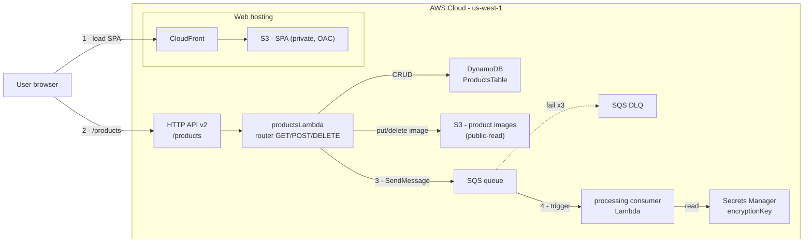
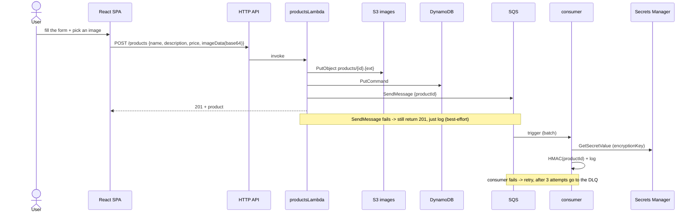

# product-management

**Serverless** - **AWS CDK v2 (TypeScript)** - **Node 22** - region **us-west-1**

> A product-catalog application on AWS: create/view/delete products with images, plus asynchronous
> processing after creation. All infrastructure is Infrastructure as Code (AWS CDK) in a **single
> stack** - deployed with one command. Runs and debugs **fully offline** with LocalStack.

---

## Table of contents

- [What product-management does](#what-product-management-does)
- [Architecture](#architecture)
- [How it works](#how-it-works)
- [Tech stack](#tech-stack)
- [Directory structure](#directory-structure)
- [Quickstart](#quickstart)
- [Run locally](#run-locally-no-aws-required)
- [Testing](#testing)
- [Deploy to AWS](#deploy-to-aws)
- [Data model & API](#data-model--api)
- [Design principles](#design-principles)

---

## What product-management does

A web app for managing a product catalog. Users **create** products (with an image), **view** the
whole catalog, and **delete** products. Every successful create pushes a message onto a queue for
**asynchronous processing** (so it never blocks the user's response).

- **Backend:** one Lambda router (Node 22 / TypeScript) for CRUD `/products` behind an HTTP API
  Gateway, plus one consumer Lambda that processes the SQS queue.
- **Frontend:** a React + Vite SPA - runs in 3 modes (mock / local / live).
- **Storage:** DynamoDB (products) + S3 (images) + Secrets Manager (HMAC key) + SQS/DLQ (queue).

The API is open (no auth); security lives at the infrastructure layer: least-privilege IAM, KMS,
TLS, and cdk-nag.

---

## Architecture



Two S3 buckets with clearly separated roles:

| Bucket | Contents | Access |
|--------|----------|--------|
| product-images | product images | **public-read** |
| site | SPA assets | **private** + CloudFront/OAC |

---

## How it works

### Create flow (synchronous + asynchronous)



1. **Create** - the SPA sends `POST /products` with a base64 image.
2. **Store** - the Lambda uploads the image to S3, saves the record to DynamoDB, sends a message to
   SQS, and returns **201**.
3. **Best-effort queue** - if SendMessage fails, it still returns 201 (the product already exists)
   and only logs the error.
4. **Async processing** - the consumer receives the message, reads the secret, and computes an HMAC
   of the `productId`.
5. **Retry & DLQ** - a failing consumer is retried up to 3 times, then the message moves to the
   dead-letter queue.

---

## Tech stack

| Layer | Technology |
|-------|------------|
| IaC | AWS CDK v2 (TypeScript), cdk-nag |
| Backend | AWS Lambda (Node 22, TypeScript), esbuild bundling |
| API | API Gateway **HTTP API v2** (no auth) |
| Data | DynamoDB (PK `id`), KMS encryption |
| Storage | S3 (images public-read; SPA private) |
| Async | SQS + Dead Letter Queue |
| Secrets | AWS Secrets Manager |
| Frontend | React + Vite |
| Hosting | S3 + CloudFront (OAC) |
| Test | Vitest (unit) + Playwright (E2E) |
| Local | LocalStack (Docker) |
| Region | us-west-1 |

---

## Directory structure

```
product-management/
  bin/product-management.ts        # CDK App entry: read stage, add tags, enable cdk-nag
  lib/
    product-management-stack.ts    # ONE stack composing 5 constructs
    constructs/
      data-construct.ts            # KMS + DynamoDB (PK id)
      product-images-construct.ts  # S3 public-read (product images)
      products-api-construct.ts    # Lambda router + HTTP API v2
      processing-construct.ts      # SQS + DLQ + consumer Lambda + Secret
      web-hosting-construct.ts     # S3 private + CloudFront/OAC + SPA deploy
    utils.ts                       # resource-name helper
  lambdas/                         # STANDALONE Node TS project (own package.json)
    src/products/                  # router handler, consumer, operations, shared
    tests/products/                # Vitest mirroring src
    local/server.ts                # dev HTTP server (API) -> LocalStack
    local/worker.ts                # poll SQS -> invoke consumer (local)
    docker-compose.yml             # LocalStack
  frontend/                        # React + Vite SPA (gateway pattern)
    src/                           # components, hooks, services (mock/http)
    e2e/                           # Playwright specs (mock mode)
  test/                            # Vitest CDK assertions (constructs + stack)
  cdk.json                         # context.stages.<env> (config-driven)
```

---

## Quickstart

### Requirements

- Node.js **22.x** (`node --version`)
- Docker (for LocalStack when running locally)
- AWS CLI configured (only needed for a real deploy): `aws sts get-caller-identity`
- AWS CDK CLI matching `aws-cdk-lib` in `package.json`

### Install

Infrastructure deps live at the root; Lambda runtime deps in `lambdas/`; UI deps in `frontend/` -
**three separate locations**:

```bash
npm install                          # root: aws-cdk-lib, cdk-nag, vitest, esbuild...
npm --prefix lambdas install         # Lambda runtime (SDK v3, uuid, tsx)
npm --prefix frontend install        # React, Vite, Vitest, Playwright, ESLint
```

### Quick check (no AWS required)

```bash
npm run typecheck                    # tsc for infrastructure
npm test                             # Vitest: constructs + stack + lambdas
npx cdk synth -c stage=dev           # print CloudFormation, run cdk-nag, no errors
```

---

## Run locally (no AWS required)

Three modes, pick what you need:

| Mode | Needs | Use when |
|------|-------|----------|
| **1. Mock** | Nothing | Coding/previewing the UI fast, zero backend |
| **2. Full-stack local** | Docker (LocalStack) | Testing the real flow: FE + backend + emulated AWS |
| **3. Live** | Deployed backend | Verifying against real AWS |

### 1. Mock - UI only, in-memory

```bash
npm --prefix frontend run dev:mock   # http://localhost:5173 (catalog is seeded with 1 product)
```

### 2. Full-stack local - FE + backend + LocalStack

LocalStack emulates S3 + DynamoDB + SQS + Secrets Manager. The real backend runs on your machine
with **unchanged** production code (SDK v3 is pointed at LocalStack via `AWS_ENDPOINT_URL`).

```bash
# Terminal 1 - LocalStack (Docker)
npm --prefix lambdas run aws:up      # LocalStack at http://localhost:4566

# Terminal 2 - local API
npm --prefix lambdas run dev         # http://localhost:4000 (auto-creates table + bucket + queue)

# Terminal 3 - local consumer (processes SQS)
npm --prefix lambdas run worker      # polls the queue -> invokes the consumer; seeds secret + DLQ

# Terminal 4 - frontend
npm --prefix frontend run dev:local  # http://localhost:5173 -> calls http://localhost:4000
```

When done: `npm --prefix lambdas run aws:down`.

> Stop servers with **Ctrl+C** (do not use Stop-Process/taskkill on Windows).

Call the API directly:

```bash
curl http://localhost:4000/products
curl -X POST http://localhost:4000/products \
  -H "Content-Type: application/json" \
  -d '{"name":"Tee","description":"Cotton tee","price":25,"imageData":"data:image/png;base64,aGVsbG8="}'
```

### 3. Live - local FE + deployed AWS backend

```bash
cp frontend/.env.example frontend/.env    # set VITE_API_BASE_URL = the API endpoint after deploy
npm --prefix frontend run dev             # calls the real API
```

---

## Testing

| Layer | Tool | Location | Command |
|-------|------|----------|---------|
| Unit (infra) | Vitest | `test/**` | `npm test` (root) |
| Unit (backend) | Vitest | `lambdas/tests/**` | `npm --prefix lambdas test` |
| Unit (frontend) | Vitest | `frontend/tests/**` | `npm --prefix frontend test` |
| E2E (UI) | Playwright | `frontend/e2e/**` | `npm --prefix frontend run test:e2e` |

E2E runs in **mock mode** (deterministic, zero AWS); Playwright starts/stops the dev server itself.

### One gate: `verify`

```bash
cd frontend
npx playwright install chromium      # once per machine
npm run verify                       # tsc -> eslint -> vitest -> playwright
```

Any failing step exits non-zero. A `pre-commit` hook is included (runs the fast `verify:fast`):
after `git init`, enable it with `git config core.hooksPath .githooks`.

---

## Deploy to AWS

Configuration is per **stage** in `cdk.json` (`context.stages.<env>`); pick a stage with
`-c stage=<env>`.

```bash
# Once per account + region
aws sts get-caller-identity                     # get your Account ID
npx cdk bootstrap aws://YOUR_ACCOUNT_ID/us-west-1

# Build the SPA first so it is uploaded to S3/CloudFront (if skipped, the backend still deploys)
npm --prefix frontend run build

npx cdk diff  -c stage=dev                      # preview changes
npx cdk deploy -c stage=dev                     # deploy the whole stack
```

After deploying, CDK prints the outputs: site URL (CloudFront), API endpoint, table name, image
bucket name, and queue URL. Smoke-test:

```bash
curl https://YOUR_API_ID.execute-api.us-west-1.amazonaws.com/products
```

Tear down when unused (to avoid ongoing charges):

```bash
npx cdk destroy -c stage=dev
```

---

## Data model & API

```ts
interface Product {
  id: string;          // PK (uuid)
  name: string;
  description: string;
  price: number;
  imageUrl: string;    // points to the image in S3
  createdAt: string;   // ISO 8601
  updatedAt: string;
}
```

| Method | Route | Body | Returns |
|--------|-------|------|---------|
| GET | `/products` | - | `200` + array of Product |
| POST | `/products` | `{name, description, price, imageData}` | `201` + `{message, product}` |
| DELETE | `/products/{id}` | - | `200` + `{message}` / `404` if not found |

- `imageData` is a base64 data URI (`data:image/png;base64,...`), limited to ~6MB.
- Missing required fields -> `400`. System errors -> `500`.

---

## Design principles

- **One stack composed from L3 constructs** - single responsibility + reuse; atomic
  deploy/destroy, no cross-stack exports.
- **Config-driven stages** - environment differences live in `cdk.json`, never hardcoded.
- **cdk-nag** enabled at the entry point; every suppression carries a reason.
- **Least-privilege IAM** (`grant*`), **KMS** for sensitive resources, `enforceSSL`.
- **Product image bucket is public-read** (intentional, to serve images directly to browsers);
  the SPA bucket stays private + CloudFront/OAC.
- **Local-first** - LocalStack + a dev server that reuses the real `handler`; production code does
  not branch on the environment.
```
