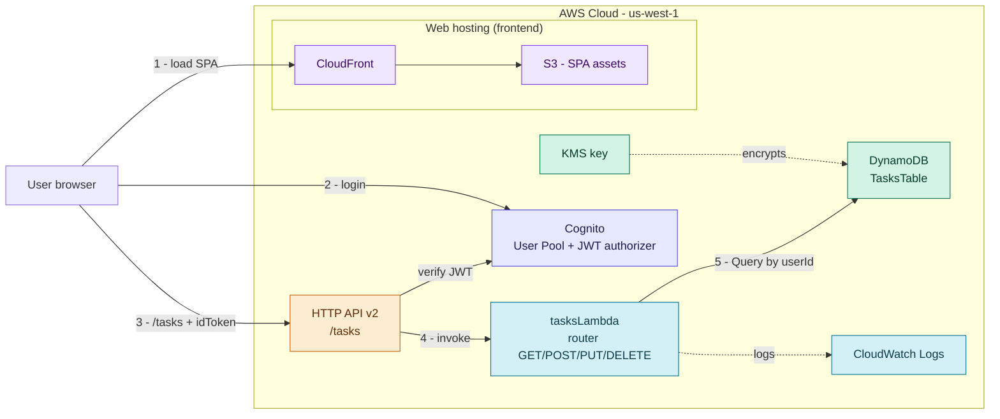
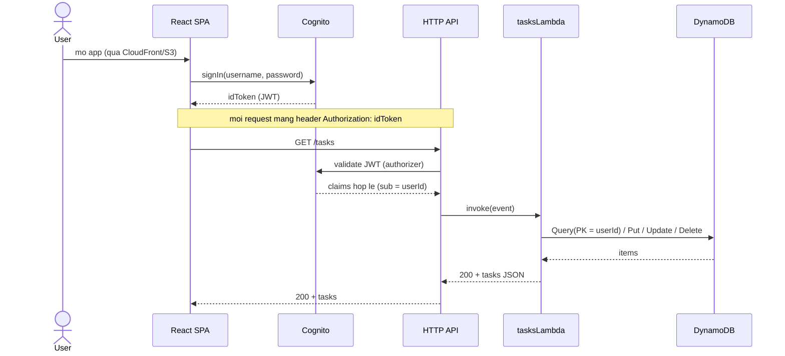

# Taskly

**Serverless** · **AWS CDK v2 (TypeScript)** · **Node 22** · region **us-west-1** · **no VPC**

> Ứng dụng ToDo serverless trên AWS CDK - đồng thời là **template mẫu để học và tái sử dụng**.
> Muốn học sâu, đọc: **[Học AWS CDK](docs/learn-cdk.md)** · **[Học code Lambda TypeScript](docs/learn-lambda-ts.md)** · **[Học code Frontend React](docs/learn-react.md)**.

---

## Taskly làm gì

Web app quản lý công việc. Người dùng **đăng nhập** rồi **tạo / xem / đổi trạng thái / sửa /
xoá** các task của **riêng mình** - không ai thấy task của người khác.

- **Backend:** một Lambda CRUD (Node 22 / TypeScript) trên DynamoDB, sau HTTP API Gateway.
- **Frontend:** React + Vite SPA - xem mục "Frontend" + [docs/learn-react.md](docs/learn-react.md).
- **Bảo mật:** Cognito (JWT) + IAM least-privilege + KMS + TLS. Không VPC (xem mục "Vì sao không VPC").

Toàn bộ hạ tầng là **Infrastructure as Code** (AWS CDK) trong **một stack** - deploy một lệnh.

---

## Kiến trúc



Bề mặt public duy nhất là CloudFront/S3 (UI) và HTTP API - đều sau Cognito JWT. DynamoDB và
Lambda **không nằm trên mạng công khai**; chỉ truy cập qua AWS API, gated bằng IAM.

---

## Cách hoạt động (auth + request)



1. **Đăng nhập một lần** - SPA gọi Cognito `signIn`, nhận `idToken` (JWT).
2. **Gắn token vào mọi call** - header `Authorization: idToken`.
3. **API Gateway gác cổng** - JWT authorizer verify token; sai/hết hạn -> **401** trước khi tới Lambda.
4. **Lambda định tuyến** - một function, `switch` theo httpMethod, đọc `userId` từ `sub` trong token.
5. **Dữ liệu theo user** - `GET /tasks` dùng `Query(PK = userId)`, mỗi người chỉ thấy task của mình.

---

## Tech stack

| Tầng | Công nghệ |
|------|-----------|
| IaC | AWS CDK v2 (TypeScript), cdk-nag |
| Backend | AWS Lambda (Node 22, TypeScript), esbuild bundling |
| API | API Gateway **HTTP API v2** + JWT authorizer |
| Data | DynamoDB (PK `userId`, SK `id`), mã hoá KMS |
| Auth | Amazon Cognito User Pool |
| Frontend | React + Vite + `aws-amplify` |
| Hosting | S3 + CloudFront |
| Test | Vitest |
| Region | us-west-1 |

---

## Cấu trúc thư mục

```
taskly/
├── bin/taskly.ts                # CDK App entry: đọc stage, add Tags, cdk-nag
├── lib/
│   ├── taskly-stack.ts          # MỘT stack compose 4 construct (deploy/destroy nguyên tử)
│   ├── constructs/              # L3 constructs (mỗi cái có Props interface + JSDoc)
│   │   ├── data-construct.ts        # KMS + DynamoDB
│   │   ├── auth-construct.ts        # Cognito user pool + client
│   │   ├── tasks-api-construct.ts   # Lambda + HTTP API + JWT authorizer
│   │   └── web-hosting-construct.ts # S3 (OAC) + CloudFront + deployment
│   └── utils.ts                 # helper đặt tên resource
├── lambdas/                     # dự án Node TS ĐỘC LẬP (package.json + deps riêng)
│   ├── src/tasks/               # code Lambda runtime
│   ├── tests/tasks/             # Vitest, mirror src/
│   ├── local/server.ts          # dev HTTP server (full-stack local) - tái dùng handler
│   └── docker-compose.yml       # DynamoDB Local
├── test/                        # Vitest CDK assertions
│   ├── constructs/              # test từng L3 construct
│   └── stack/                   # test composition (wiring + tags + outputs)
├── frontend/                    # React + Vite SPA (xem docs/learn-react.md)
├── cdk.json                     # context.stages.<env> (config-driven)
└── package.json  tsconfig.json  vitest.config.ts
```

---

## Quickstart (backend)

### Yêu cầu
- Node.js **22.x** (`node --version`)
- AWS CLI đã cấu hình (`aws sts get-caller-identity` trả về Account + Arn)
- AWS CDK CLI **>= 2.1140** (`cdk --version`) - phải khớp `aws-cdk-lib` trong `package.json`

### Cài đặt
Deps hạ tầng ở root; **deps runtime của Lambda ở `lambdas/`** (dự án Node TS riêng, không lẫn):

```bash
npm install                 # root: aws-cdk-lib, cdk-nag, vitest, esbuild...
cd lambdas && npm install && cd ..   # runtime deps cho Lambda
```

### Bootstrap (một lần cho account + region)
```bash
# Account ID:  aws sts get-caller-identity
cdk bootstrap aws://YOUR_ACCOUNT_ID/us-west-1
```

### Kiểm tra + test
```bash
npm run typecheck    # tsc hạ tầng
npm test             # Vitest: infra (constructs + stack) + lambdas
cdk synth -c stage=dev   # in CloudFormation, chạy cdk-nag, không lỗi
```

---

## Chạy local (không phải lúc nào cũng deploy AWS)

Ba cách chạy, chọn theo nhu cầu:

| Mode | AWS? | Dùng khi |
|------|------|----------|
| **1. Mock** | ❌ Không gì | Code/style UI nhanh |
| **2. Full-stack local** | ❌ (Docker) | Test luồng thật FE + backend + DynamoDB (chạy local) |
| **3. Live** | ⚠️ Backend deploy 1 lần | Verify tích hợp Cognito thật |

### 1. Mock - chỉ UI, in-memory, 0 backend
```bash
cd frontend && npm run dev:mock      # http://localhost:5173 - đăng nhập bằng bất kỳ email/password
```

### 2. Full-stack local - FE + backend + DynamoDB Local (Docker)
Backend thật chạy trên máy: DynamoDB Local (Docker) + **cùng `handler` code** qua một dev HTTP server.
```bash
# Terminal 1 - backend + DB
cd lambdas
npm run db:up        # DynamoDB Local (8000) + admin UI (http://localhost:8001)
npm run dev          # API local -> http://localhost:4000

# Terminal 2 - frontend
cd frontend && npm run dev:local     # FE -> gọi http://localhost:4000

# Khi xong:  cd lambdas && npm run db:down
```
- **Xem/sửa data:** mở **http://localhost:8001** (dynamodb-admin) - browse table `taskly-local-tasks`, xem/sửa/xoá item.
- Không có Cognito local -> identity lấy từ header `x-user-id` (mặc định `local-dev-user`); FE dùng
  token giả (`VITE_DEV_AUTH`). Đổi `x-user-id` để test cô lập theo user.

### 3. Live - FE local + backend AWS đã deploy
```bash
cd taskly && cdk deploy -c stage=dev          # deploy 1 lần, lấy outputs
# copy frontend/.env.example -> frontend/.env, điền API URL + Cognito ids
cd frontend && npm run dev                     # gọi Cognito + API thật
```

> Cơ chế: cờ `VITE_USE_MOCKS` / `VITE_DEV_AUTH` chọn implementation trong `createServices()`
> (`MockAuthService`/`MockTaskDataService` hay service thật). Component **không đổi** - cùng
> `AuthGateway`/`TaskGateway` interface. Backend local tái dùng **nguyên `handler`** (SDK v3 tự
> trỏ DynamoDB Local qua `AWS_ENDPOINT_URL_DYNAMODB`, không sửa code production).

### Debug bằng VS Code (breakpoint)

Mở folder **`taskly/`** trong VS Code, vào **Run and Debug** (`Ctrl+Shift+D`), chọn config
(`.vscode/launch.json`):

| Config | Làm gì |
|--------|--------|
| **Backend: local API (debug)** | Chạy `lambdas/local/server.ts` (tsx) + tự `db:up`; breakpoint trong `lambdas/src/tasks/*.ts` |
| **Frontend: mock (debug)** | Vite mock + mở Chrome; breakpoint trong `frontend/src/*.tsx` |
| **Frontend: local backend (debug)** | Vite trỏ `localhost:4000` + Chrome |
| **Full-stack local (debug)** | Compound: chạy backend + frontend cùng lúc, breakpoint **cả hai đầu** |

> Cần Docker đang chạy (cho backend). Dùng Edge thì đổi `"chrome"` -> `"msedge"` trong `launch.json`.

---

## Testing

Hai tầng test tách biệt theo glob nên không đè nhau:

| Tầng | Tool | Vị trí | Chạy |
|------|------|--------|------|
| **Unit** | Vitest | `frontend/tests/**/*.test.tsx` · infra `test/**` · `lambdas/tests/**` | `npm test` |
| **E2E (UI)** | Playwright | `frontend/e2e/**/*.spec.ts` | `npm run test:e2e` |

**E2E** chạy trên **mock mode** (deterministic, in-memory, 0 AWS). Playwright tự start/stop
`dev:mock` qua `webServer` - một lệnh, không cần mở server tay. Selector chỉ dùng accessibility
roles/labels nên không vỡ khi đổi CSS.

```bash
cd frontend
npx playwright install chromium   # một lần cho máy (browser vào cache, không vào repo)
npm run test:e2e                  # headless (nhanh)
npm run test:e2e:headed           # mở browser để coi quá trình chạy
npm run test:e2e:ui               # UI mode (xem/step từng bước)
npm run test:e2e:report           # mở HTML report của lần chạy trước
```

Khi một test fail: Playwright lưu **trace + screenshot + video** (`playwright-report/`) để tự chẩn đoán.

### E2E trên local backend thật (verify luồng thật)
Suite mock ở trên là cổng deterministic. Khi muốn kiểm chứng **luồng thật** (handler + DynamoDB Local),
chạy suite riêng ở `e2e/local/` qua `playwright.local.config.ts` - Playwright tự dựng **cả backend
(`lambdas` dev :4000) lẫn frontend (`dev:local` :5173)** và **mở browser** để bạn coi.

```bash
# Cần Docker đang chạy. Bật DynamoDB Local trước (nếu chưa):
cd lambdas && npm run db:up

cd ../frontend && npm run test:e2e:local     # headed; DB local rỗng nên spec tự tạo + tự xoá data
```

> Vì DynamoDB Local khởi động **rỗng** (không có seed như mock), spec local **seed-independent**:
> tự tạo task với title duy nhất, chạy hết vòng đời CRUD, rồi xoá - không phụ thuộc dữ liệu sẵn có.
> `verify` **không** gọi suite này (cần Docker, không deterministic) - nó chỉ chạy suite mock.

### Một cổng: `verify`
```bash
cd frontend && npm run verify     # tsc -b -> eslint . -> vitest run -> playwright test
```
Fail bất kỳ bước nào -> exit non-zero. Đây là cổng chạy trước khi review (và Phase 5 CI chỉ cần gọi nó).

---

## Deploy (backend)

Cấu hình theo **stage** ở `cdk.json` (`context.stages.<env>`); chọn stage bằng `-c stage=<env>`.

```bash
cdk diff -c stage=dev      # xem trước thay đổi
cdk deploy -c stage=dev    # deploy nguyên khối
```

Sau deploy, output in ra API endpoint + Cognito ids. Smoke-test bằng `curl` với `idToken` hợp lệ:

```bash
curl -H "Authorization: YOUR_ID_TOKEN" https://YOUR_API_ID.execute-api.us-west-1.amazonaws.com/tasks
```

> Lambda được **build khi cần** qua `cdk deploy`: CDK dùng esbuild bundle `lambdas/src/tasks/handler.ts`
> tự động - không cần build tay. Chi tiết ở [Học AWS CDK](docs/learn-cdk.md) (mục 7 - Assets & bundling).

Hosting (S3+CloudFront) sẽ chỉ upload SPA khi `frontend/dist` tồn tại; chưa build FE thì synth/deploy
vẫn chạy (bỏ qua upload, có cảnh báo).

---

## Data model & API

```ts
type TaskStatus = 'todo' | 'doing' | 'done';

interface Task {
  userId: string;      // PK - Cognito sub (chủ sở hữu)
  id: string;          // SK - taskId (uuid)
  title: string;
  status: TaskStatus;  // convert thành enum tại API boundary
  createdAt: string;   // ISO 8601
  updatedAt: string;   // ISO 8601
}
```

`/tasks`: `GET` (list của tôi) · `POST` (tạo) · `PUT /{id}` (sửa title/status) · `DELETE /{id}`.

---

## Học sâu (dành cho học lại + kế thừa)

| Guide | Nội dung |
|-------|----------|
| **[docs/learn-cdk.md](docs/learn-cdk.md)** | Primer AWS CDK đầy đủ: App/Stack/Construct, L1/L2/L3, Aspects/cdk-nag, Context/stages, Assets/bundling, cross-stack, testing, lệnh CDK |
| **[docs/learn-lambda-ts.md](docs/learn-lambda-ts.md)** | Học lại code Lambda TypeScript - walkthrough từng file trong `lambdas/src/tasks` |
| **[docs/learn-react.md](docs/learn-react.md)** | Học lại code Frontend React/TS - walkthrough từng file: gateway pattern, 3 mode chạy, hooks, optimistic update |

---

## Frontend (React + Vite SPA)

Code React đã có ở `frontend/src` (gateway pattern cho phép chạy mock/local/live không đổi
component). Walkthrough từng file: **[docs/learn-react.md](docs/learn-react.md)**. Cách chạy local +
E2E: xem mục "Chạy local" và "Testing" ở trên.

---

## Nguyên tắc template (giữ khi kế thừa)

- **Một stack compose từ L3 constructs** - SRP + tái dùng, deploy/destroy nguyên tử (xem
  [ADR-0002](../docs/adr/0002-l3-constructs-single-stack.md)).
- **Config-driven stages** - khác biệt môi trường ở `cdk.json`, không hardcode.
- **cdk-nag** bật ở entry point - cổng compliance; mọi suppression kèm lý do.
- **Least-privilege IAM**, **KMS** cho tài nguyên nhạy cảm, `BlockPublicAccess.BLOCK_ALL`, `enforceSSL`.
- **Comment "tại sao"**, không comment "cái gì". **Secrets** ở Secrets Manager / SSM.

### Vì sao không VPC

DynamoDB/Lambda không có "cổng mạng" public để chặn - chỉ truy cập qua AWS API, gated bằng IAM.
Ranh giới bảo mật là **IAM + Cognito + KMS + TLS**, không phải mạng. VPC chỉ cần khi thêm
RDS/Redis/EC2, cần egress control, hoặc compliance ép private networking.

---

## Roadmap

| Phase | Nội dung | Trạng thái |
|-------|----------|-----------|
| 0 | Bootstrap CDK + Vite | ✅ |
| 1 | Spine: Cognito + HTTP API + Lambda (`GET`/`POST`) + DynamoDB | ✅ |
| 2 | CRUD đầy đủ (`PUT`/`DELETE`) + validation + error mapping | ✅ |
| 3 | Frontend SPA + S3/CloudFront hosting | ✅ (code) |
| E2E | Playwright UI testing (mock + local backend) + `verify` gate | ✅ |
| 4 | ~~Attachment + observability~~ - **descoped**, tách sang project playground riêng | - |
| 5 | CI/CD (capstone): CDK Pipelines (GitHub) ci -> staging -> prod | ⬜ |

